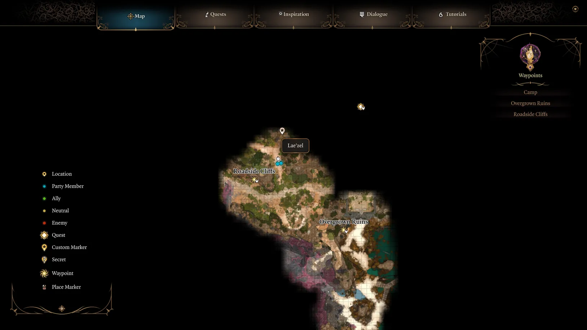

# Free Lae'zel

## Map

https://mapgenie.io/baldurs-gate-3/maps/wilderness?x=-0.4969830541567717&y=0.6312495589481557&zoom=13.530625373790826

## Requirements

No requirements.

## Steps

1. After nautiloid crash, follow the coast north, until you reach a building with a locked door.

2. Head West, past the wreckage with the Intellect Devourers. **Defeat them.**

3. Head North, then East, **recruit Gale** from the out of control sigil on the cliff wall.

4. Head north, where you’ll find a pair of Tieflings watching over a captive Lae’zel. 

5. Option 1: convince Tieflings to flee. **Option 2: convince to deal with her immediately - will trigger a fight with Lae'zel as an ally.**

6. **Ask Lae'zel to join the party.**

7. Go Nort-West to find a Shovel

8. Go South and find **Astarion.**